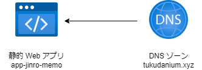

# jinro-memo

## 概要

Vite & React18 & TypeScriptで作成した、人狼のメモアプリ。
以前Discodeでやっていた人狼系ゲームに参加した際、各プレイヤーの宣言が全く覚えられなかったので作ってみた。

## 環境構築

node.jsをインストール。
https://nodejs.org/en

yarnをグローバルインストール

```bash
npm install -g yarn
# バージョン確認
yarn -v
```

パッケージをインストール

```bash
  yarn install
```

## 実行方法

下記コマンドの実行でデバッグが開始されます。

```bash
  yarn dev
```

## デプロイ

Azureの静的WEBアプリのCIにより、masterブランチへのコミット時に自動でデプロイされます。

https://www.tukudanium.xyz/

## 構成

独自ドメインのネームサーバーをAzureのDNSゾーンにし、静的Webアプリに割り当て。


